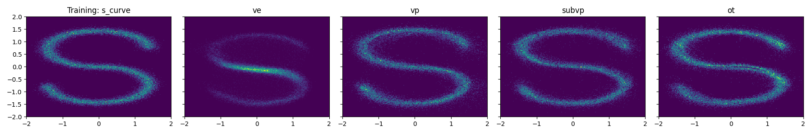
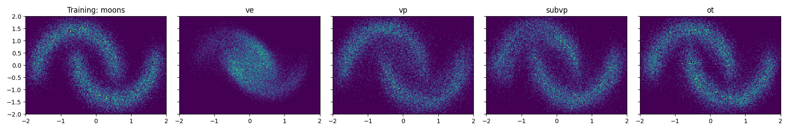
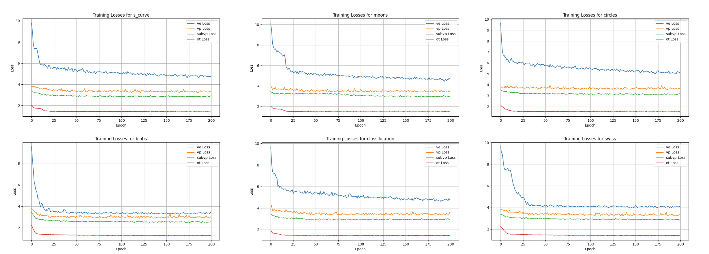

## Flow Matching Implementation

### Description

This is a simple and easy to follow implementation for "Flow Matching for generative modeling" 2022 Lipman et al.


Besides the VP/VE trajectory for comparison, we've also added the **sub-VP** trajectory from [Song et al. 2021](https://arxiv.org/abs/2011.13456). Detailed Derivation of the sub-VP trajectory can be seen in [sub-VP-flow-matching.pdf](sub-VP-flow-matching.pdf).


### Figures

Below are some selected toy examples of comparison between (ve/vp/sub-vp/ot) on 2d data for visualization.






And the corresponding loss curve during training.




### Running

Creating virtual env:

```bash
conda create -n fm python=3.10.14
conda activate fm
```

Installing  necessary packages (only a few like torch, matplotlib, numpy .etc):

```bash
pip install -r requirements.txt
```

Running demo:

```
python flow_matching.py
```


Hyperparameter choices are provided in the main function:

```python
    datasets = ["moons", "circles", "blobs", "noisy_circles", "s_curve", "classification", "swiss"]
    trajectories = ["ve", "vp", "subvp", "ot"]
    
    kwargs_training = {
        "n_points": 30_000,
        "n_samples": 30_000,
        "n_epochs": 200,
        "batch_size": 2048,
    }
    kwargs_debug = {
        "n_points": 100,
        "n_samples": 100,
        "n_epochs": 10,
        "batch_size": 2048,        
    }
```


### Future Version

**Implementation regarding Image generation on cifar10 dataset**

We have implemented a standard version for image generation tasks based on the framework of [EDM](https://arxiv.org/abs/2206.00364). By specifically making the following modifications:

+ Remove original preconditions (since it's not necessary for FM) and losses.
+ Add Flow matching trajectories and losses
+ Modify the training loop (score matching to flow matching)
+ Modify the sampling method (stochastic to deterministic ODE)

However, due to lack of GPUs, experimental results and checkpoints are not available. Thus looking forward to collaborations on the topic of flow matching in the future. [email](yougotaaa@gmail.com)


### References

This code is a heavy modification based on the following repository:

https://github.com/gle-bellier/flow-matching

Paper references:

[Flow Matching for Generative Modeling](https://arxiv.org/abs/2210.02747) 2022 Lipman et al.

[Score-Based Generative Modeling through Stochastic Differential Equations](https://arxiv.org/abs/2011.13456) 2020 Song et al.

[Elucidating the Design Space of Diffusion-Based Generative Models](https://arxiv.org/abs/2206.00364) 2022 Karras et al.