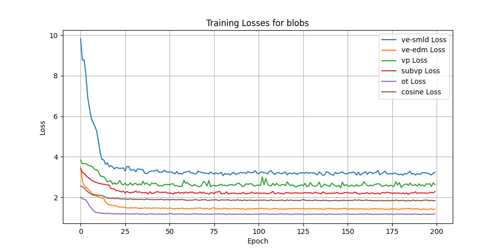
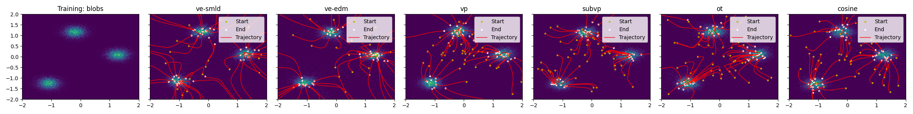
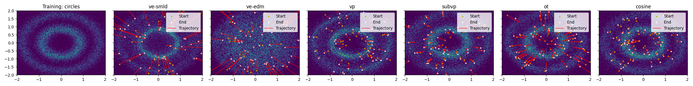
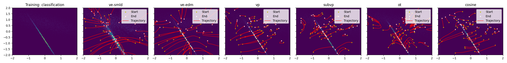
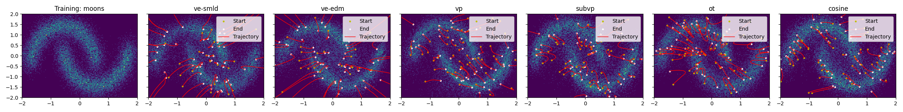
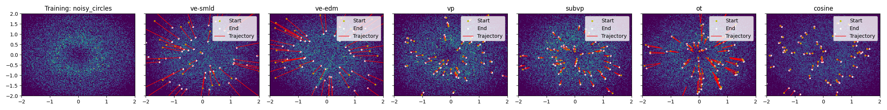
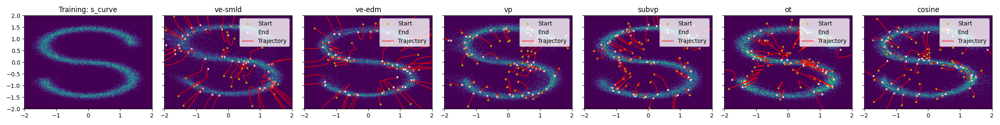
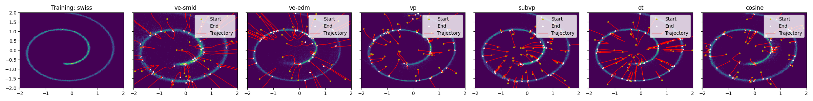

## Flow Matching Implementation

### Description

This is a simple and easy to follow implementation for "Flow Matching for generative modeling" 2022 Lipman et al.


Besides the VP/VE/OT trajectory for comparison, we've also added the **sub-VP** trajectory from [Song et al. 2021](https://arxiv.org/abs/2011.13456).

**EDM(VE)** trajectory from [Karras et al. 2022](https://arxiv.org/abs/2206.00364), **Cosine** trajectory from [Nichol et al. 2021](https://arxiv.org/abs/2102.09672). Formal formulation can be found in [trajectories](./docs/trajectories.pdf).


### Figures

Selected Training loss curve. (other's can be found in the loss_img folder)



Visualized trajectory and final distribution. (leftmost : training set, right : sampled)
















It appears that the optimal transport is not straight in many cases.


### Running

Creating virtual env:

```bash
conda create -n fm python=3.10.14
conda activate fm
```

Installing  necessary packages (only a few like torch, matplotlib, numpy .etc):

```bash
pip install -r requirements.txt
```

Running demo:

```py
python flow_matching.py # for training
python trajvis.py # for visualization
```


Hyperparameter choices:

`flow_matching.py`

```python
    datasets = ["moons", "circles", "blobs", "noisy_circles", "s_curve", "classification", "swiss"]
    
    trajectories = ["ve-smld","ve-edm", "vp", "subvp", "ot","cosine"]
    kwargs_training = {
        "n_points": 30_000,
        "n_samples": 30_000,
        "n_epochs": 200,
        "batch_size": 2048,
    }
    kwargs_debug = {
        "n_points": 100,
        "n_samples": 100,
        "n_epochs": 10,
        "batch_size": 2048,        
    }
```

`trajvis.py`

```python
    datasets = ["moons", "circles", "blobs", "noisy_circles", "s_curve", "classification", "swiss"]
    
    trajectories = ["ve-smld","ve-edm", "vp", "subvp", "ot","cosine"]
    kwargs_sampling = {
        "n_points": 30_000,
        "n_samples": 30_000,
        "n_epochs": 200,
        "n_trajectory": 50,
        "schedule": 'time_uniform',
        "nfe": 200,
    }
```


### References

Code reference:

https://github.com/gle-bellier/flow-matching

Paper references:

[Flow Matching for Generative Modeling](https://arxiv.org/abs/2210.02747) 2022 Lipman et al.

[Score-Based Generative Modeling through Stochastic Differential Equations](https://arxiv.org/abs/2011.13456) 2020 Song et al.

[Elucidating the Design Space of Diffusion-Based Generative Models](https://arxiv.org/abs/2206.00364) 2022 Karras et al.