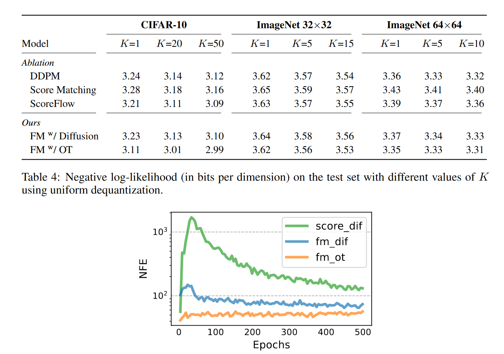
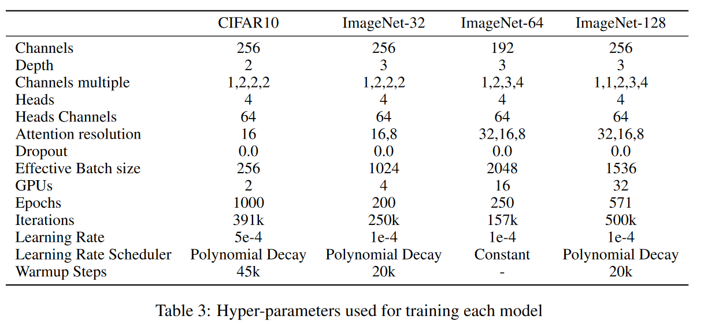

## objective







## Find the current limit

Consistency model for flow matching:

FID: NFE=2: CFM: 5.34(150 Steps), CM: 5.83(800 steps) kind of absurd comparison.

[Consistency Flow Matching: Defining Straight Flows with Velocity Consistency](https://arxiv.org/abs/2407.02398) `2 Jul 2024 PKU+ermon`


## Obstacles

+ stamina.
+ valuable feedback.
+ computational resources.


## plan


### training cost(use edm if):

obstacles: cifar experiment: 2days 8gpus v100. 200Ming. batchsize 512, around 40000 iterations.

if 1 v100 gpu: 16days, cost:  around 768 yuan. hard for myself to run. -> find collaborators.

### training method

model architectures: DDPM++, NCSN++,ADM what should I use (if follow lipman : ADM).

three interpretations: combine edm framework with the three training objectives: score,flow,noise matching

### sampling method

solver : euler, heun, dopri.(RK).


# progress

## training 

training loop sketch finish - ready for heavy test: train.py  try it out


test with training:

```
nohup torchrun --standalone --nproc_per_node=1 train.py --outdir=training-runs     --data=datasets/cifar10-32x32.zip --arch=ddpmpp --batch-gpu=128 --total_steps=3 --trajectory=ot > training-runs/output.txt 2>&1 &
```

successfully run through the code:


see how to train the loop (1*V100 16day)

## sampling

then sampling procedure 


```
python generate.py --outdir=out --steps=18 \
    --network=https://nvlabs-fi-cdn.nvidia.com/edm/pretrained/edm-cifar10-32x32-cond-vp.pkl
```


**runnable**, but i don't have a trained model:

the input for the original f in edm is (x, noise_level (0.002-80))

th einput for the current f in cfm is (x, t (0-1)).


**and calculation of fid.** Done using edm.

